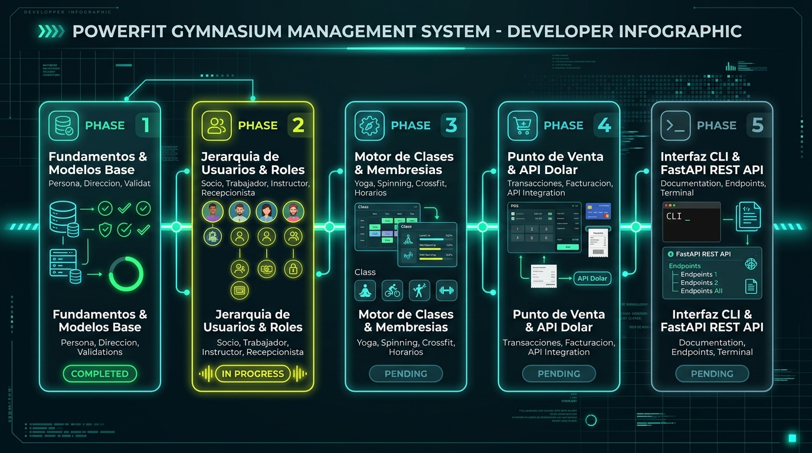

# 🏋️ PowerFit - Sistema de Gestión de Gimnasio

Sistema desarrollado en Python bajo el paradigma de **Programación Orientada a Objetos (POO)** para la asignatura de POO. El proyecto implementa los requerimientos de negocio y diseño estructural UML especificados en la arquitectura del sistema.

---

## 🗺️ Roadmap de Desarrollo del Proyecto



El desarrollo del sistema PowerFit se estructura en 5 fases secuenciales basadas en el modelo de clases UML y el levantamiento de requerimientos:

| Fase | Módulo / Componente | Estado | Descripción clave |
| :--- | :--- | :---: | :--- |
| **Fase 1** | **Fundamentos & Modelos Base** | 🟢 Completada | `Persona` (RUT Módulo 11), `Direccion` (tipos de vivienda) y `test.py`. |
| **Fase 2** | **Jerarquía de Usuarios & Roles** | 🟡 Próxima | `Socio`, `Trabajador` y roles (`Instructor`, `Recepcionista`, `Administrador`). |
| **Fase 3** | **Motor de Clases & Membresías** | ⚪ Pendiente | `Clase` (`Yoga`, `Spinning`, `Crossfit`), cálculo de cupos, `InscripcionMensual` y `MembresiaMensual`. |
| **Fase 4** | **Punto de Venta & API Dólar** | ⚪ Pendiente | `Suplemento`, control de stock, `IndicadorDolar` (conversión CLP) y `Venta`. |
| **Fase 5** | **Interfaz CLI & Entrega Final** | ⚪ Pendiente | Menú interactivo por consola según perfil, QA integral y documentación final. |

---

## 📌 Estado de la Clase `Persona` (`persona.py`)

La clase `Persona` actúa como la plantilla base (clase abstracta padre) para representar a todos los individuos del sistema (Socios, Trabajadores, Instructores, Recepcionistas, etc.).

### 📋 Atributos
Todos los atributos han sido definidos con anotaciones de tipo y alineados estrictamente con el diagrama UML (`UML/ProyectGym.drawio`):

| Atributo | Tipo | Descripción |
| :--- | :--- | :--- |
| `rut` | `str` | Identificador único nacional de la persona |
| `nombres` | `str` | Nombres de la persona (plural según especificación UML) |
| `apellidoPaterno` | `str` | Primer apellido de la persona |
| `apellidoMaterno` | `str` | Segundo apellido de la persona |
| `telefono` | `str` | Número telefónico de contacto |
| `correoElectronico` | `str` | Dirección de correo electrónico de contacto |

### 🛠️ Métodos

#### Constructor `__init__`
Inicializa todos los atributos obligatorios al instanciar una objeto `Persona`:
```python
def __init__(self, rut: str, nombres: str, apellidoPaterno: str, apellidoMaterno: str, telefono: str, correoElectronico: str)
```

#### Métodos Getter y Setter (Encapsulamiento)
- **Getters (lectura)**: `getRut()`, `getNombres()`, `getApellidoPaterno()`, `getApellidoMaterno()`, `getTelefono()`, `getCorreoElectronico()`.
- **Setters (modificación)**: `setTelefono(telefono)`, `setCorreoElectronico(correoElectronico)` (los atributos de identidad se conservan protegidos e inmutables).

#### Métodos de Validación (UML)
- **`validarRut() -> bool`**: Valida la autenticidad del RUT y su dígito verificador mediante el **Algoritmo Módulo 11** (soporta puntos, guión, espacios y dígito verificador 'K'/'k').
- **`validarTelefono() -> bool`**: Valida que el formato telefónico contenga entre 8 y 15 dígitos utilizando expresiones regulares.
- **`validarCorreoElectronico() -> bool`**: Valida el formato de la dirección de correo electrónico mediante expresiones regulares (`r"^[^\s@]+@[^\s@]+\.[^\s@]+$"`).

---

## 📌 Estado de la Clase `Direccion` (`direccion.py`)

La clase `Direccion` representa la ubicación física y postal dentro del sistema PowerFit.

### 📋 Atributos
Todos los atributos han sido definidos con anotaciones de tipo y alineados estrictamente con el diagrama UML (`UML/ProyectGym.drawio`):

| Atributo | Tipo | Descripción |
| :--- | :--- | :--- |
| `idDireccion` | `int` | Identificador único de la dirección |
| `tipoDireccion` | `str` | Tipo de vivienda (`'casa'`, `'dpto'`, `'block'`) |
| `calle` | `str` | Nombre de la calle o avenida |
| `numero` | `str` | Número de la dirección |
| `referencia` | `str` | Información adicional o referencia de llegada |

### 🛠️ Métodos y Encapsulamiento

#### Constructor `__init__`
Inicializa y valida los datos de la dirección al instanciar:
```python
def __init__(self, idDireccion: int, tipoDireccion: str, calle: str, numero: str, referencia: str)
```
- Incluye validación para `tipoDireccion` permitiendo únicamente: `'casa'`, `'dpto'` o `'block'` (ignorando mayúsculas y espacios en blanco). En caso de ingresar un valor inválido, lanza un `ValueError`.

#### Métodos Getter y Setter (Encapsulamiento)
- **Getters (lectura)**: `getIdDireccion()`, `getTipoDireccion()`, `getCalle()`, `getNumero()`, `getReferencia()`.
- **Setters (modificación)**: `setIdDireccion()`, `setTipoDireccion()`, `setCalle()`, `setNumero()`, `setReferencia()`.
  - `setTipoDireccion(tipoDireccion)`: Aplica la misma regla de validación restringida que el constructor.

---

## 🧪 Pruebas Unitarias (`test.py`)

Se cuenta con una suite de pruebas unitarias ([`test.py`](./test.py)) para validar el comportamiento de los métodos de validación de `Persona` (`validarRut()`, `validarTelefono()`, `validarCorreoElectronico()`).

### Ejecución de Pruebas
Para ejecutar las pruebas en la consola:
```bash
python3 test.py
```

Las pruebas cubren 19 escenarios en total:
- **RUT (10 casos)**: RUTs válidos con formato completo (`12.345.678-5`), sin puntos/guiones (`123456785`), DV `'K'`/`'k'`, repetitivos, incorrectos, con letras, vacíos o demasiado cortos.
- **Teléfono (4 casos)**: Formato chileno con prefijo (`+56 9...`), 9 dígitos, cadenas cortas y cadenas vacías.
- **Correo Electrónico (5 casos)**: Formato estándar, dominios cortos, correos sin `@`, sin dominio y vacíos.

---

## 🚀 Ejecución y Activación de la API REST (`FastAPI`)

El proyecto incluye un servidor de API REST desarrollado con **FastAPI** ubicado en la carpeta `prueba de api/api.py`.

### 📦 Requisitos Previos
Asegúrate de tener instaladas las dependencias necesarias:
```bash
pip install fastapi uvicorn pydantic
```

### ⚡ Iniciar el Servidor de la API
Para levantar el servidor en modo de desarrollo con recarga automática:

```bash
cd "prueba de api"
uvicorn api:app --reload --port 8000
```

### 🌐 Documentación Interactiva (Swagger / ReDoc)
Una vez iniciado el servidor, accede desde tu navegador web a:
- **Documentación Swagger UI (Interactive)**: [http://127.0.0.1:8000/docs](http://127.0.0.1:8000/docs)
- **Documentación ReDoc**: [http://127.0.0.1:8000/redoc](http://127.0.0.1:8000/redoc)

### 📌 Endpoints Principales Disponibles
- `POST /socios`: Registrar un nuevo socio.
- `GET /socios/{rut}`: Obtener detalles de un socio por RUT.
- `POST /clases`: Crear una nueva clase dirigida (`yoga`, `spinning`, `crossfit`).
- `POST /clases/{codigo}/inscripcion`: Inscribir socio a una clase con validación de cupos.
- `POST /ventas`: Registrar venta de suplementos y productos.

---

## 📝 Historial de Cambios Realizados

A continuación se detallan las modificaciones realizadas paso a paso sobre el proyecto:

1. **Ajuste de Atributos y Eliminación Temporal del Constructor:**
   - Se declararon los atributos base `rut`, `nombre`, `apellidoPaterno`, `apellidoMaterno`, `telefono` y `correoElectronico` con sus correspondientes anotaciones de tipo `str`.

2. **Alineación de Nombres con Diagrama UML e Inclusión del Constructor `__init__`:**
   - Se corrigió el nombre del atributo de `nombre` a **`nombres`** (en plural) para mantener 100% de coherencia con el diagrama UML (`ProyectGym.drawio`).
   - Se definió el método constructor `__init__` asignando cada uno de los 6 atributos requeridos.

3. **Inclusión de Métodos de Validación y Comentarios:**
   - Se incorporaron los métodos `validarRut()`, `validarTelefono()` y `validarCorreoElectronico()`.
   - Se agregaron comentarios explicativos y docstrings detallados en cada sección de la clase.

4. **28-09-2026 SE AGREGARON GET Y SET DE LOS ATRIBUTOS:**
   - Se encapsularon los atributos de la clase con prefijo `_`.
   - Se implementaron métodos `get` para todos los atributos: `getRut()`, `getNombres()`, `getApellidoPaterno()`, `getApellidoMaterno()`, `getTelefono()` y `getCorreoElectronico()`.
   - Se implementaron métodos `set` para aquellos atributos editables de contacto: `setTelefono()` y `setCorreoElectronico()`.

5. **IMPLEMENTACIÓN DEL ALGORITMO MÓDULO 11 EN `validarRut()` Y CREACIÓN DE `test.py`:**
   - Se implementó el algoritmo de Módulo 11 en el método `validarRut()` de la clase `Persona`.
   - Se creó e integró el script `test.py` para pruebas automatizadas del validador de RUT.

6. **Implementación y validación de la Clase `Direccion` (`direccion.py`):**
   - Declaración de atributos con tipos según el diagrama UML (`idDireccion: int`, `tipoDireccion: str`, `calle: str`, `numero: str`, `referencia: str`).
   - Implementación del constructor `__init__` con encapsulamiento de atributos con prefijo `_`.
   - Implementación de métodos getters y setters para todos los atributos.
   - Validación del atributo `tipoDireccion` restringido a `"casa"`, `"dpto"` y `"block"`, sanitizando espacios y mayúsculas (`strip().lower()`).

7. **Incorporación de Infografía del Roadmap y Actualización de Pruebas:**
   - Se integró la infografía visual de arquitectura y fases del proyecto (`roadmap_powerfit.jpg`).
   - Se incorporó la sección del Roadmap estructurado en 5 fases en el `README.md`.

8. **Creación del Historial de Cambios (`CHANGELOG.md`) y Sincronización de Ramas:**
   - Se creó el archivo formal de registro de versiones [`CHANGELOG.md`](./CHANGELOG.md) bajo el estándar Keep a Changelog.
   - Se auditó y sincronizó la rama `rama1.0` con la rama principal `main`.

9. **Refactorización, Limpieza de Duplicados e Integración de Validaciones Regex:**
   - Se eliminó el subdirectorio redundante `prueba de api/PowerFit/`.
   - Se implementaron las validaciones con expresiones regulares para `validarTelefono()` y `validarCorreoElectronico()` en `Persona`.
   - Se amplió `test.py` a 19 pruebas unitarias automatizadas cubriendo los 3 métodos de validación.

---

## 📁 Estructura del Repositorio

- `persona.py`: Implementación de la clase base `Persona` (RUT Módulo 11, validación regex de teléfono y correo).
- `direccion.py`: Implementación de la clase `Direccion` con validación de tipo de vivienda.
- `test.py`: Suite de 19 pruebas unitarias automatizadas para validar `Persona`.
- `CHANGELOG.md`: Registro formal de cambios y control de versiones del proyecto.
- `roadmap_powerfit.jpg`: Infografía visual del Roadmap y fases de desarrollo del proyecto.
- `UML/ProyectGym.drawio`: Diagrama UML de clases oficial del proyecto.
- `Requirements/`: Documentación del levantamiento de requerimientos y auditoría del diseño UML.
