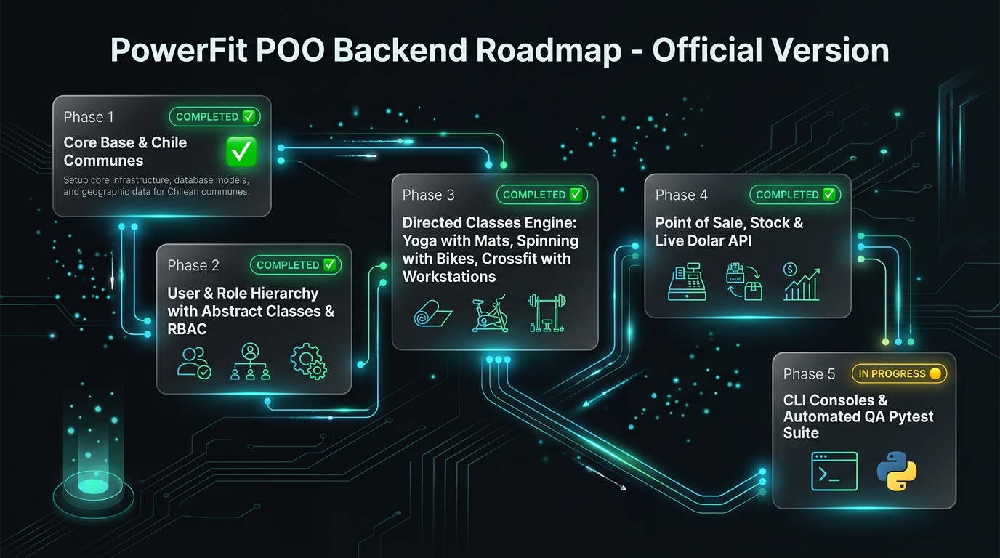
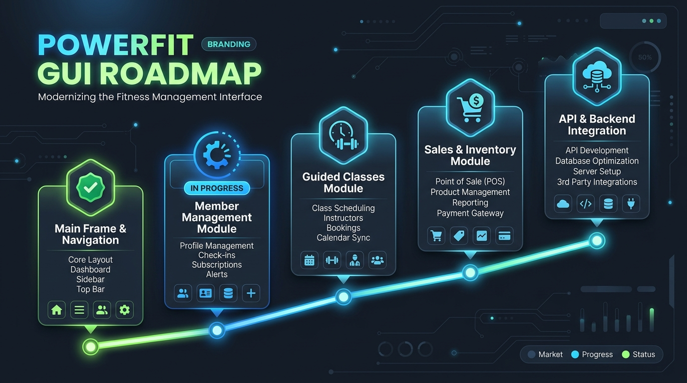
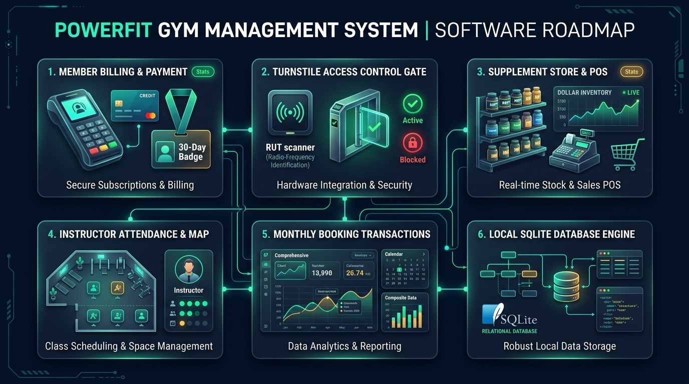
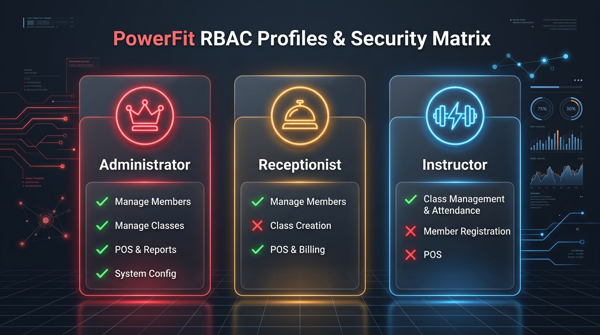

# 🏋️ PowerFit - Sistema de Gestión de Gimnasio

Sistema desarrollado en Python bajo el paradigma de **Programación Orientada a Objetos (POO)** para la asignatura de POO. El proyecto implementa los requerimientos de negocio y diseño estructural UML especificados en la arquitectura del sistema.

---

## 🗺️ Roadmap de Desarrollo del Proyecto



El desarrollo del sistema PowerFit se estructura en 5 fases secuenciales basadas en el modelo de clases UML y el levantamiento de requerimientos:

| Fase | Módulo / Componente | Estado | Descripción clave |
| :--- | :--- | :---: | :--- |
| **Fase 1** | **Fundamentos & Modelos Base** | 🟢 Completada | `Persona` (RUT Módulo 11), `Direccion` y `Comuna` (346 comunas INE ordenadas A-Z). |
| **Fase 2** | **Jerarquía de Usuarios & Roles** | 🟢 Completada | `Socio` (`permitirIngreso()`), `Trabajador` (`tienePermiso()`), `Instructor` (`dictarClase()`) y `Recepcionista` (`cobrarMensualidad()`). |
| **Fase 3** | **Motor de Clases & Membresías** | 🟢 Completada | `ClaseDirigida` (`hayCupo()`), `Yoga` (`colchonetas`), `Spinning` (`bicicletas`), `Crossfit` (`estacionesTrabajo`) y `InscripcionMensual`. |
| **Fase 4** | **Punto de Venta & API Dólar** | 🟢 Completada | `Suplemento` (`calcularPrecioCLP()`), control de stock y `IndicadorDolar` (API `mindicador.cl`). |
| **Fase 5** | **Interfaz CLI & QA Final** | 🟡 En Desarrollo | Menú interactivo por consola según perfil, suite pytest e integración final. |

### 📌 Backlog / Próximas Tareas a Implementar (Fase 3 en adelante)
- [ ] **Modelos de Dominio de Clases Dirigidas (`src/models/`):**
  - Crear clase base `Clase` con atributos comunes (código, nombre, horario, cupo máximo, instructor asignado).
  - Implementar subclases especializadas: `Yoga`, `Spinning` y `Crossfit`.
  - Crear modelo `Membresia` con tipos de planes, vigencia y reglas de acceso.
- [ ] **Lógica de Negocio y Cupos:**
  - Control dinámico de inscripción de socios a clases verificando cupos disponibles.
  - Validación de solapamiento de horarios e instructores.
- [ ] **Punto de Venta e Inventario (Fase 4):**
  - Modelo `Suplemento` y registro transaccional `Venta`.
  - Servicio de conversión de divisas en vivo consumiendo la API de `mindicador.cl`.
- [ ] **Consola CLI y QA (Fase 5):**
  - Menú interactivo por consola adaptado según rol RBAC del usuario autenticado.
  - Ampliación de la suite de pruebas unitarias (`pytest`).

---

---

## 🎨 Roadmap de Interfaz Gráfica GUI (PySide6)



| Hito | Módulo Visual | Estado | Descripción clave |
| :--- | :--- | :---: | :--- |
| **Hito 1** | **Marco Principal & Navegación** | 🟢 Completada | `QMainWindow` (800x600), menú horizontal `QHBoxLayout`, botones con CSS y `QStackedWidget`. |
| **Hito 2** | **Módulo de Gestión de Socios** | 🟢 Completada | Formulario `QFormLayout`, combobox con las 346 comunas de Chile ordenadas alfabéticamente (A-Z), campos UML de dirección y alertas. |
| **Hito 3** | **Mapa Visual de Salas & Clases Dirigidas** | 🟢 Completada | Formulario para Yoga, Spinning y Crossfit, control de cupos personalizados y **Mapa Interactivo de Puestos en Vivo** (Bicicletas 🚲, Mats 🧘, Estaciones 🏋️). |
| **Hito 4** | **Punto de Venta & API Dólar en Vivo** | 🟢 Completada | Catálogo de suplementos y consulta en tiempo real a API `mindicador.cl` autocompletando CLP. |
| **Hito 5** | **Tablas `QTableWidget` en Tiempo Real** | 🟢 Completada | Tablas dinámicas interactivas agregando registros en vivo en Socios, Clases y Ventas. |
| **Hito 6** | **Perfilamiento, Roles & Autenticación** | 🟢 Completada | Pantalla de Login, autenticación y control de acceso dinámico por rol (Admin, Recepción, Instructor). |
| **Hito 7** | **Diseño Cyber-Gym & Dual-Theme Adaptable** | 🟢 Completada | Rediseño visual QSS estilo Dark Slate/Neon Orange y conmutador en vivo para **Modo Claro** y **Modo Oscuro** (macOS/Windows). |


---

## 📋 Roadmap Sumativa 2: Requisitos de Negocio & Tareas Faltantes



Plan de acción basado estrictamente en el modelo oficial del profesor y los flujos operacionales del gimnasio:

| Módulo | Actor / Área | Estado | Descripción clave |
| :--- | :--- | :---: | :--- |
| **Módulo 1** | **🛎️ Recepcionista** | 🟢 Completada | `cobrarMensualidad()` extendiendo vigencia +30d. Estados "Al Día", "Vencida/Impago", "Plan Cancelado". |
| **Módulo 2** | **🚪 Control Portería** | 🟢 Completada | Simulador interactivo de torniquete con `Socio.permitirIngreso()` y **Popups de Alerta Flotantes (`QMessageBox.critical`)**. |
| **Módulo 3** | **🛒 Punto de Venta** | 🟢 Completada | `Suplemento.hayStock()`, descuento físico de stock en bodega y cálculo en CLP vía API Dólar. |
| **Módulo 4** | **🏋️ Instructor** | 🟢 Completada | `marcarAsistencia(socio, clase)` validando estado de membresía desde mapa de puestos. |
| **Módulo 5** | **✍️ Transacciones** | 🟢 Completada | Objeto `InscripcionMensual` agrupando `DetalleInscripcion` (Composición 1 a 1..*) y `Venta` con `DetalleVenta`. |
| **Módulo 6** | **💾 Base de Datos** | ⚪ Pendiente | Persistencia relacional local con `sqlite3` y patrón DAO. |

---

## 🔐 Matriz de Perfilamiento y Control de Acceso por Roles (RBAC)



---


## 📌 Estado de la Clase `Persona` (`persona.py`)

La clase `Persona` actúa como la plantilla base (clase abstracta padre) para representar a todos los individuos del sistema (Socios, Trabajadores, Instructores, Recepcionistas, etc.).

### 📋 Atributos
Todos los atributos han sido definidos con anotaciones de tipo y alineados estrictamente con el diagrama UML (`UML/ProyectGym.drawio`):

| Atributo | Tipo | Descripción |
| :--- | :--- | :--- |
| `rut` | `str` | Identificador único nacional de la persona |
| `nombres` | `str` | Nombres de la persona (plural según especificación UML) |
| `apellidoPaterno` | `str` | Primer apellido de la persona |
| `apellidoMaterno` | `str` | Segundo apellido de la persona |
| `telefono` | `str` | Número telefónico de contacto |
| `correoElectronico` | `str` | Dirección de correo electrónico de contacto |

### 🛠️ Métodos

#### Constructor `__init__`
Inicializa todos los atributos obligatorios al instanciar una objeto `Persona`:
```python
def __init__(self, rut: str, nombres: str, apellidoPaterno: str, apellidoMaterno: str, telefono: str, correoElectronico: str)
```

#### Métodos Getter y Setter (Encapsulamiento)
- **Getters (lectura)**: `getRut()`, `getNombres()`, `getApellidoPaterno()`, `getApellidoMaterno()`, `getTelefono()`, `getCorreoElectronico()`.
- **Setters (modificación)**: `setTelefono(telefono)`, `setCorreoElectronico(correoElectronico)` (los atributos de identidad se conservan protegidos e inmutables).

#### Métodos de Validación (UML)
- **`validarRut() -> bool`**: Valida la autenticidad del RUT y su dígito verificador mediante el **Algoritmo Módulo 11** (soporta puntos, guión, espacios y dígito verificador 'K'/'k').
- **`validarTelefono() -> bool`**: Valida que el formato telefónico contenga entre 8 y 15 dígitos utilizando expresiones regulares.
- **`validarCorreoElectronico() -> bool`**: Valida el formato de la dirección de correo electrónico mediante expresiones regulares (`r"^[^\s@]+@[^\s@]+\.[^\s@]+$"`).

---

## 📌 Estado de la Clase `Direccion` (`direccion.py`)

La clase `Direccion` representa la ubicación física y postal dentro del sistema PowerFit.

### 📋 Atributos
Todos los atributos han sido definidos con anotaciones de tipo y alineados estrictamente con el diagrama UML (`UML/ProyectGym.drawio`):

| Atributo | Tipo | Descripción |
| :--- | :--- | :--- |
| `idDireccion` | `int` | Identificador único de la dirección |
| `tipoDireccion` | `str` | Tipo de vivienda (`'casa'`, `'dpto'`, `'block'`) |
| `calle` | `str` | Nombre de la calle o avenida |
| `numero` | `str` | Número de la dirección |
| `referencia` | `str` | Información adicional o referencia de llegada |

### 🛠️ Métodos y Encapsulamiento

#### Constructor `__init__`
Inicializa y valida los datos de la dirección al instanciar:
```python
def __init__(self, idDireccion: int, tipoDireccion: str, calle: str, numero: str, referencia: str)
```
- Incluye validación para `tipoDireccion` permitiendo únicamente: `'casa'`, `'dpto'` o `'block'` (ignorando mayúsculas y espacios en blanco). En caso de ingresar un valor inválido, lanza un `ValueError`.

#### Métodos Getter y Setter (Encapsulamiento)
- **Getters (lectura)**: `getIdDireccion()`, `getTipoDireccion()`, `getCalle()`, `getNumero()`, `getReferencia()`.
- **Setters (modificación)**: `setIdDireccion()`, `setTipoDireccion()`, `setCalle()`, `setNumero()`, `setReferencia()`.
  - `setTipoDireccion(tipoDireccion)`: Aplica la misma regla de validación restringida que el constructor.

---

## 🧪 Pruebas Unitarias (`test.py`)

Se cuenta con una suite de pruebas unitarias ([`test.py`](./test.py)) para validar el comportamiento de los métodos de validación de `Persona` (`validarRut()`, `validarTelefono()`, `validarCorreoElectronico()`).

### Ejecución de Pruebas
Para ejecutar las pruebas en la consola:
```bash
python3 main.py
```

### Ejecución de la Interfaz Gráfica (PySide6)

> [!IMPORTANT]
> **Versión de Python Requerida:** Python **3.10**, **3.11** o **a lo más Python 3.12** (Estable).
> **NO utilizar versiones experimentales o de bleeding-edge como Python 3.14**, ya que carecen de soporte binario C++ de la plataforma Qt/PySide6 en macOS y ocasionan fallos de inicialización `cocoa`.

La aplicación cuenta con una interfaz gráfica basada en **PySide6**. Para abrir la ventana de registro:
```bash
source .venv/bin/activate
python main.py
```
*(Asegúrate de tener instalado `PySide6` ejecutando `pip install PySide6` dentro del `.venv` de Python 3.12)*.

---

Las pruebas cubren 19 escenarios en total:
- **RUT (10 casos)**: RUTs válidos con formato completo (`12.345.678-5`), sin puntos/guiones (`123456785`), DV `'K'`/`'k'`, repetitivos, incorrectos, con letras, vacíos o demasiado cortos.
- **Teléfono (4 casos)**: Formato chileno con prefijo (`+56 9...`), 9 dígitos, cadenas cortas y cadenas vacías.
- **Correo Electrónico (5 casos)**: Formato estándar, dominios cortos, correos sin `@`, sin dominio y vacíos.

---

## 📝 Historial de Cambios Realizados

A continuación se detallan las modificaciones realizadas paso a paso sobre el proyecto:

1. **Ajuste de Atributos y Eliminación Temporal del Constructor:**
   - Se declararon los atributos base `rut`, `nombre`, `apellidoPaterno`, `apellidoMaterno`, `telefono` y `correoElectronico` con sus correspondientes anotaciones de tipo `str`.

2. **Alineación de Nombres con Diagrama UML e Inclusión del Constructor `__init__`:**
   - Se corrigió el nombre del atributo de `nombre` a **`nombres`** (en plural) para mantener 100% de coherencia con el diagrama UML (`ProyectGym.drawio`).
   - Se definió el método constructor `__init__` asignando cada uno de los 6 atributos requeridos.

3. **Inclusión de Métodos de Validación y Comentarios:**
   - Se incorporaron los métodos `validarRut()`, `validarTelefono()` y `validarCorreoElectronico()`.
   - Se agregaron comentarios explicativos y docstrings detallados en cada sección de la clase.

4. **28-09-2026 SE AGREGARON GET Y SET DE LOS ATRIBUTOS:**
   - Se encapsularon los atributos de la clase con prefijo `_`.
   - Se implementaron métodos `get` para todos los atributos: `getRut()`, `getNombres()`, `getApellidoPaterno()`, `getApellidoMaterno()`, `getTelefono()` y `getCorreoElectronico()`.
   - Se implementaron métodos `set` para aquellos atributos editables de contacto: `setTelefono()` y `setCorreoElectronico()`.

5. **IMPLEMENTACIÓN DEL ALGORITMO MÓDULO 11 EN `validarRut()` Y CREACIÓN DE `test.py`:**
   - Se implementó el algoritmo de Módulo 11 en el método `validarRut()` de la clase `Persona`.
   - Se creó e integró el script `test.py` para pruebas automatizadas del validador de RUT.

6. **Implementación y validación de la Clase `Direccion` (`direccion.py`):**
   - Declaración de atributos con tipos según el diagrama UML (`idDireccion: int`, `tipoDireccion: str`, `calle: str`, `numero: str`, `referencia: str`).
   - Implementación del constructor `__init__` con encapsulamiento de atributos con prefijo `_`.
   - Implementación de métodos getters y setters para todos los atributos.
   - Validación del atributo `tipoDireccion` restringido a `"casa"`, `"dpto"` y `"block"`, sanitizando espacios y mayúsculas (`strip().lower()`).

7. **Incorporación de Infografía del Roadmap y Actualización de Pruebas:**
   - Se integró la infografía visual de arquitectura y fases del proyecto (`roadmap_powerfit.jpg`).
   - Se incorporó la sección del Roadmap estructurado en 5 fases en el `README.md`.

8. **Creación del Historial de Cambios (`CHANGELOG.md`) y Sincronización de Ramas:**
   - Se creó el archivo formal de registro de versiones [`CHANGELOG.md`](./CHANGELOG.md) bajo el estándar Keep a Changelog.
   - Se auditó y sincronizó la rama `rama1.0` con la rama principal `main`.

9. **Refactorización, Limpieza de Duplicados y Estructuración de la API:**
   - Se renombró la carpeta `prueba de api/` a `api/` para darle un nombre estándar e independiente.
   - Se implementaron las validaciones con expresiones regulares para `validarTelefono()` y `validarCorreoElectronico()` en `Persona`.
   - Se amplió `test.py` a 19 pruebas unitarias automatizadas cubriendo los 3 métodos de validación.

10. **Reorganización Profesional del Proyecto en Arquitectura por Capas (POO):**
    - Se estructuraron los modelos del dominio en `src/models/` (`persona.py`, `comuna.py`, `direccion.py`).
    - Se centralizaron las pruebas unitarias automatizadas en `tests/test_persona.py`.
    - Se reunió la documentación, diagramas UML y requerimientos en `docs/` (`docs/requirements/`, `docs/uml/`).
    - Se mantuvieron scripts experimentales en `scratch/`.
    - Se simplificó `main.py` como punto de entrada único invocando los modelos de `src.models`.

11. **Inicio de la Interfaz Gráfica con PySide6 (`main.py`):**
    - Se implementó la clase `VentanaRegistro` heredando de `QWidget` en `main.py`.
    - Se diseñó el layout vertical (`QVBoxLayout`) con controles de entrada (`QLabel`, `QLineEdit`, `QPushButton`).
    - Se integró el bucle principal de eventos de `QApplication` y la respuesta visual interactiva con `QMessageBox.information`.

---

## 📁 Estructura del Repositorio

- `src/models/`: Clases del dominio POO desacopladas (1 archivo = 1 clase):
  - `persona.py`: Clase abstracta base `Persona` con Algoritmo Módulo 11 para RUT.
  - `socio.py`: Clase `Socio` (`fechaVencimientoMembresia`, `estadoActivo`, `permitirIngreso()`, `renovarMembresia()`, `cancelarPlan()`).
  - `trabajador.py`: Clase abstracta base `Trabajador` (`autenticar()`, `tienePermiso()`).
  - `administrador.py`: Subclase `Administrador` (`crearTrabajador()`, `crearClase()`, `reponerStock()`).
  - `instructor.py`: Subclase `Instructor` (`dictarClase()`, `marcarAsistencia()`).
  - `recepcionista.py`: Subclase `Recepcionista` (`registrarSocio()`, `cobrarMensualidad()`, `crearInscripcion()`, `registrarVenta()`).
  - `clase.py`: Clase base `Clase`, `ClaseDirigida` y especializaciones `Yoga`, `Spinning`, `Crossfit`.
  - `direccion.py` y `comuna.py`: Ubicación postal e integración de las 346 comunas INE de Chile.
  - `inscripcion.py` y `suplemento.py`: Transacciones de reserva y punto de venta con API Dólar.
- `tests/`: Suite de pruebas unitarias automatizadas (`test_persona.py`).
- `uml/`: Diagramas estructurales (`posiblediagrama.drawio.xml`).
- `docs/`: Documentación del proyecto, diagramas e infografías de arquitectura.
- `main.py`: Punto de entrada principal con interfaz PySide6, Simulador de Torniquete y Popups Alerta.
- `requirements.txt`: Dependencias del proyecto (`PySide6`, etc.).
- `CHANGELOG.md`: Registro formal de versiones y cambios del proyecto.

---

## ⚡ Instalación y Ejecución por Sistema Operativo

### 🍎 En macOS (Apple Silicon / Intel)
Debido a las políticas de seguridad de librerías dinámicas (`dyld`) en macOS para plugins C++ de Qt, se recomienda instalar y ejecutar directamente con Python 3.12 del sistema:

```bash
# Instalar dependencias globales del sistema
python3 -m pip install -r requirements.txt

# Iniciar la interfaz gráfica GUI
python3 main.py
```

### 🪟 En Windows
En Windows los entornos virtuales `.venv` funcionan sin restricciones de seguridad de plugins Qt:

```cmd
:: Crear e instalar en entorno virtual
python -m venv .venv
.venv\Scripts\activate
pip install -r requirements.txt

:: Iniciar la interfaz gráfica GUI
python main.py
```


