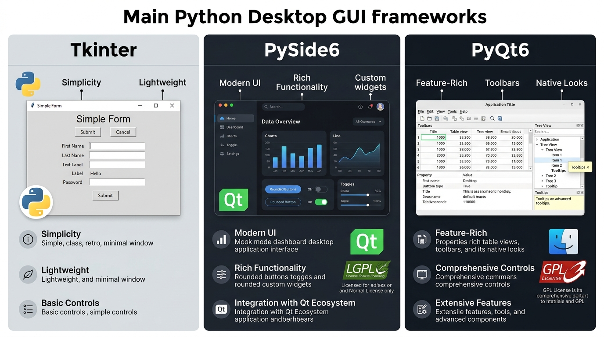

# Comparativa de Frameworks de Interfaz Gráfica (GUI) en Python: Tkinter vs PySide6 vs PyQt6

Este documento analiza y compara las tres principales librerías para el desarrollo de aplicaciones de escritorio en Python, enfocado en la toma de decisiones para el proyecto **PowerFit** (Asignatura Programación Orientada a Objetos - INACAP).

---

## 🖼️ Infografía Comparativa Visual

---

## 📊 Tabla Comparativa

| Criterio | Tkinter | PySide6 (Qt for Python) | PyQt6 |
| :--- | :--- | :--- | :--- |
| **Origen / Respaldo** | Estándar de Python (Tcl/Tk). | Oficial de The Qt Company. | Riverbank Computing. |
| **Licencia** | **PSFL / BSD** (Libre). | **LGPLv3** (Comercial/Cerrado mediante enlazado dinámico). | **GPLv3 / Comercial** (Requiere liberar código o pagar licencia). |
| **Instalación** | Incluido en Python (`import tkinter`). | `pip install PySide6` | `pip install PyQt6` |
| **Diseño Visual** | Código manual / Herramientas limitadas. | 🟢 **Qt Designer** (WYSIWYG con drag & drop). | 🟢 **Qt Designer** (WYSIWYG con drag & drop). |
| **Personalización / Estilos** | Básica / Tcl ttk styles. | 🟢 **QSS** (Estilo avanzado tipo CSS). | 🟢 **QSS** (Estilo avanzado tipo CSS). |
| **Manejo de Eventos** | Callbacks (`command`, `bind`). | **Signals & Slots** (Desacoplado y tipado). | **Signals & Slots** (Desacoplado y tipado). |
| **Componentes Avanzados** | Básicos. | 🟢 Tablas complejas, gráficos, árboles, layouts dinámicos. | 🟢 Tablas complejas, gráficos, árboles, layouts dinámicos. |

---

## 🔍 Análisis Detallado

### 1. Tkinter
* **Ventajas**:
  - No requiere instalar dependencias adicionales.
  - Curva de aprendizaje extremadamente baja.
  - Excelente para prototipos iniciales y scripts sencillos.
* **Desventajas**:
  - Estética retro por defecto.
  - Creación de interfaces complejas requiere mucho código manual repetitivo.

### 2. PySide6 (Recomendación Principal para Proyectos Escalables)
* **Ventajas**:
  - **Licencia LGPLv3**: Permite su uso en aplicaciones comerciales sin tener que hacer público el código fuente del proyecto.
  - Es la herramienta **oficial de Qt para Python**.
  - Permite usar **Qt Designer** para diseñar visualmente ventanas y exportar archivos `.ui` o código Python limpio.
* **Desventajas**:
  - Mayor curva de aprendizaje inicial debido a la arquitectura de Qt.

### 3. PyQt6
* **Ventajas**:
  - Mismas funcionalidades y herramientas visuales que PySide6.
* **Desventajas**:
  - **Licencia GPLv3**: Si distribuyes la aplicación, estás obligado a liberar todo el código bajo GPL salvo que compres una licencia comercial privada.

---

## 💡 Recomendación para el Proyecto PowerFit

1. **Para prototipado rápido / entrega mínima**: **Tkinter** es suficiente para crear formularios sencillos integrados a las clases de `persona.py`, `socio.py` y `comuna.py`.
2. **Para una entrega profesional y modular**: **PySide6** es la opción ideal si se desea utilizar Qt Designer para diseñar la interfaz visualmente manteniendo el modelo POO desacoplado de la vista.
